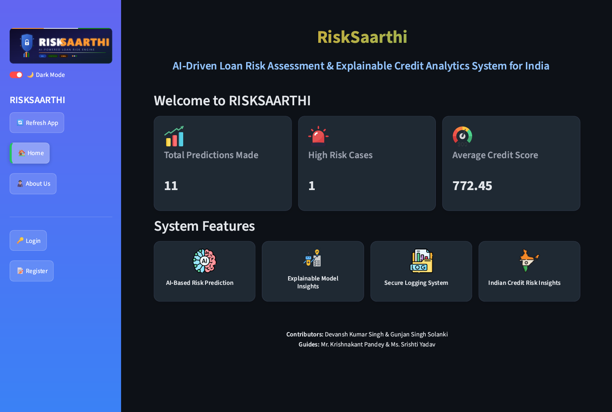
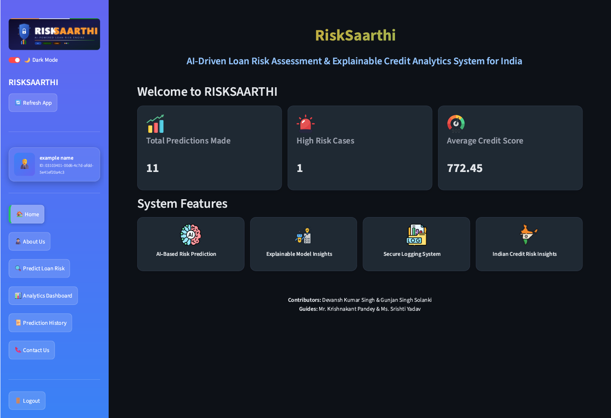
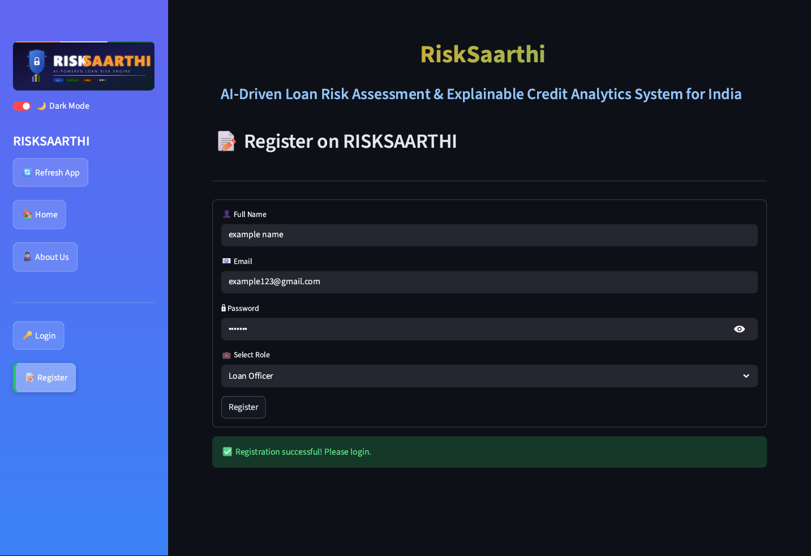
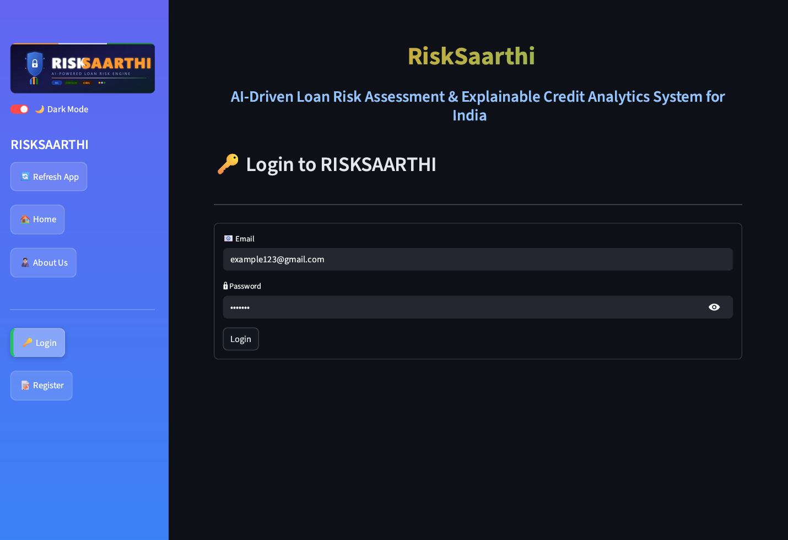
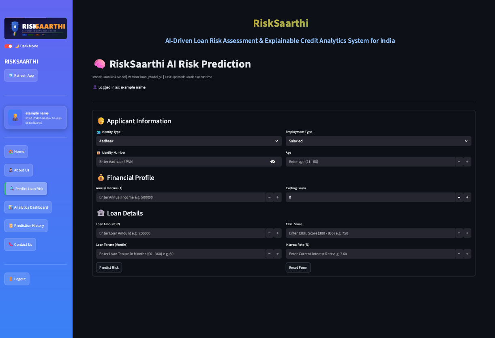
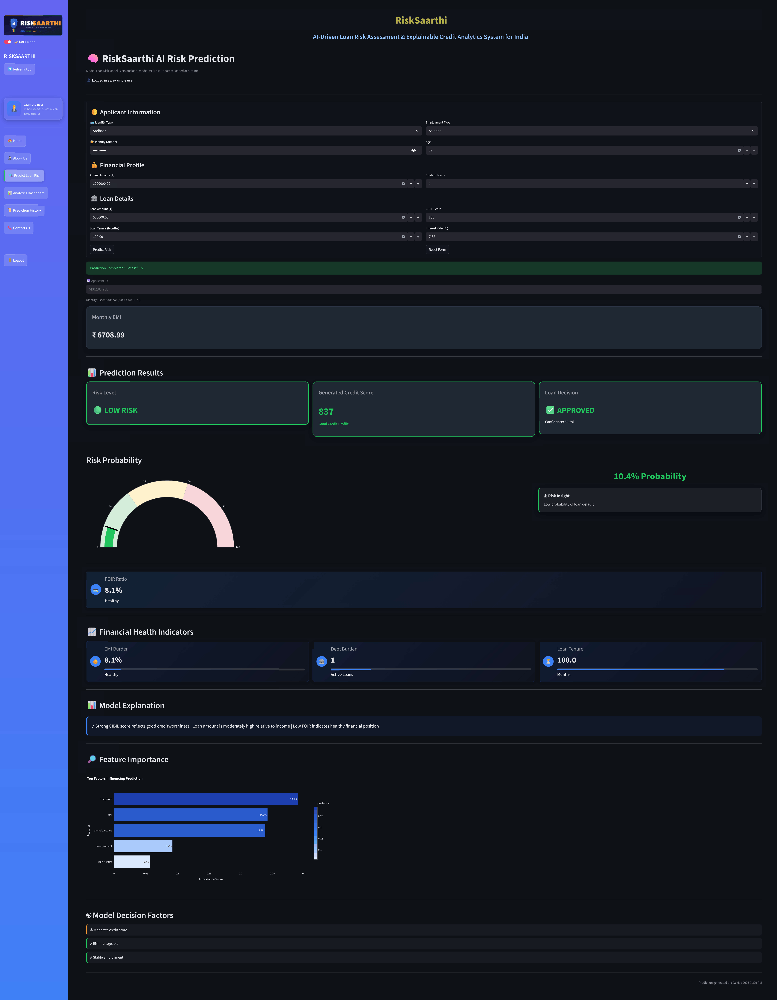
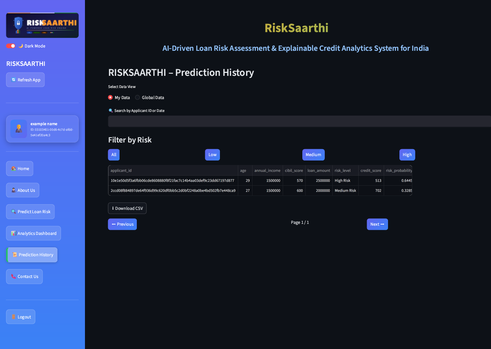
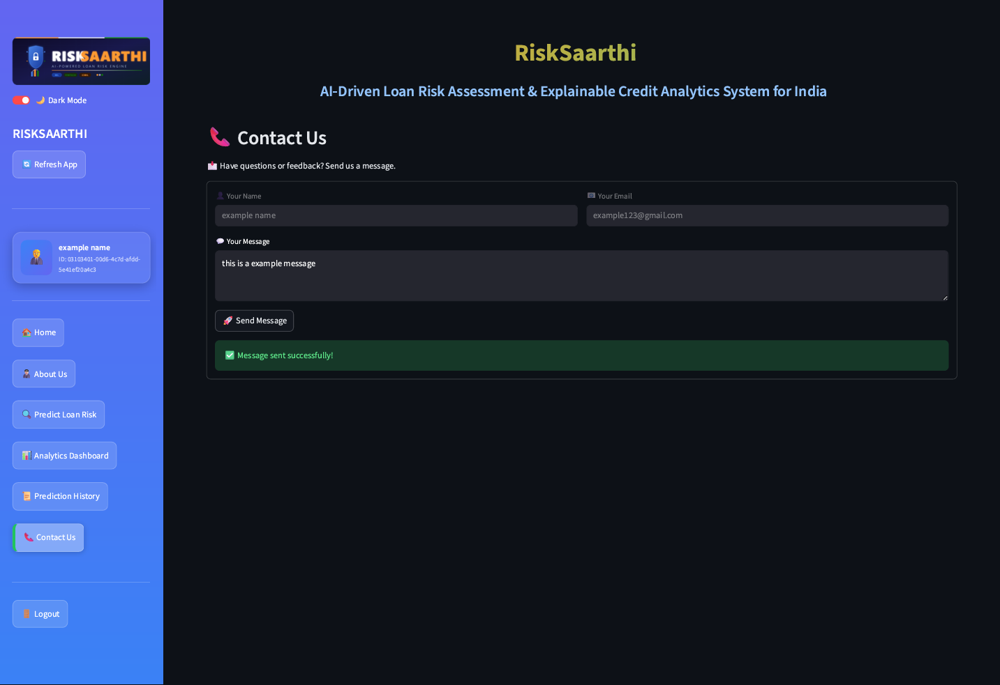

# 🚀 RISKSAARTHI — AI-Powered Loan Risk Prediction System
### Python | FastAPI | Streamlit | ML | MySQL
 
## 📌 Overview
 
**RISKSAARTHI** is a production-style Machine Learning + FinTech analytics system that enables:
 
- 📊 Loan default risk prediction
- 🤖 Explainable AI insights
- 💳 Dynamic credit scoring (300–900 scale)
- 📈 Real-time analytics dashboard
- 🧾 Prediction audit & history tracking
- 📩 User interaction via contact system
 
It simulates a real-world credit risk engine used by NBFCs and digital lenders. 
This project bridges the gap between ML models and real-world financial decision systems by simulating a deployable risk engine.
 
---
 
## 🎯 Key Features
 
✅ ML-based Default Prediction  
✅ Risk Probability → Risk Bands (Low / Medium / High)  
✅ Dynamic Credit Score Mapping  
✅ Explainable AI (rule-based reasoning)  
✅ Prediction History Storage (MySQL)  
✅ Real-time Analytics Dashboard  
✅ Feature Importance Extraction  
✅ Logging (audit + debugging)  
✅ Contact & Feedback System (API + DB)  
✅ Scalable Architecture (production-ready design)
 
---
 
## 🇮🇳 India-Specific Design
 
- Uses **CIBIL Score (300–900)** instead of FICO
- Simulates **NBFC underwriting workflows**
- Implements **FOIR-based risk logic**
- Aligns with **RBI digital lending patterns**
- Provides explanations similar to real loan rejection logic
 
---
 
## 🏗️ System Architecture
 
```
Synthetic Data → MySQL Database → ML Training → Model (.pkl)
                                           ↓
                                      FastAPI Backend
                                           ↓
                    Prediction + Explanation + Model Info API
                                           ↓
           Stored in loan_applications, prediction_results & contact_messages
                                           ↓
                          Streamlit Dashboard (UI Layer)
```
 
---
 
## ⚙️ End-to-End Workflow
 
```
User Input
   ↓
Data Validation (Pydantic)
   ↓
Feature Engineering
   ↓
ML Model Prediction
   ↓
Risk Classification
   ↓
Credit Score Calculation
   ↓
Explanation Generation
   ↓
Database Storage
   ↓
Analytics Dashboard Visualization
```
 
---
 
## 🤖 Model Registry & Fallback System

RISKSAARTHI implements a lightweight Model Registry system with a multi-level fallback strategy to ensure reliability.

### 🔁 Model Loading Priority:

1. **Manual Override (Highest Priority)**
   - Controlled via `model_metadata.json`
   - Allows explicit selection of model version

2. **Database Model Registry**
   - Fetches latest active model from `model_metadata` table

3. **Fallback Model (Safe Default)**
   - Hardcoded model used if all else fails

### ✅ Key Benefits:
- Fault-tolerant model serving
- Version control & traceability
- Easy rollback to previous models
- Production-like resilience

---

## 🔐 Authentication & User Management

RISKSAARTHI includes a secure user authentication system with role-based access.

### 👤 Features:
- User Registration API (`/api/register`)
- User Login API (`/api/login`)
- Role-based users:
  - Loan Officer
  - Auditor
  - Admin (extendable)

### 🔒 Security:
- Passwords are securely hashed before storage
- Unique email enforcement
- Session-based login handling (Streamlit)

### 🧩 Future Enhancements:
- JWT-based authentication
- Role-based access control (RBAC)
- Admin dashboard for user management
 
---
 
## 📂 Project Structure
 
```
RISKSAARTHI/
│
├── app/                # FastAPI Backend
│   ├── api/            # Routes
│   ├── services/       # DB + logic
│   ├── models/         # Model loader
│
├── ml/                 # Training pipeline
├── frontend/           # Streamlit UI
├── database/           # SQL schema
├── logs/               # Logging system
├── tests/              # Testing
├── screenshots/
│
├── .env
├── pytest.ini
├── .gitignore
├── requirements.txt
├── README.md
```
 
---
 
## ⚙️ Backend APIs

### 🔹 Register
```
POST /api/register
```

### 🔹 Login
```
POST /api/login
```
 
### 🔹 Prediction
```
POST /api/predict
```
 
### 🔹 Analytics
```
GET /api/analytics
```
 
### 🔹 Model Info
```
GET /api/model-info
```
 
### 🔹 Contact
```
POST /api/contact
```
Stores user messages in `contact_messages` table.

---

### 🔹 Sample Request (Prediction)

```json
{
  "user_id": "1",
  "identity_type": "PAN",
  "identity_number": "ABCDE1234F",
  "age": 30,
  "annual_income": 500000,
  "cibil_score": 750,
  "employment_type": "Salaried",
  "loan_amount": 200000,
  "loan_tenure": 60,
  "existing_loans": 1,
  "interest_rate": 7.5
}
```

### 🔹 Sample Response

```json
{
  "prediction": 0,
  "probability": 9.23,
  "risk_band": "Low Risk",
  "risk_level": "Low",
  "credit_score": 845,
  "explanation": "Strong CIBIL score reflects good creditworthiness | Low FOIR indicates healthy financial position",
  "top_factors": [
    {"feature": "cibil_score", "importance": 0.32},
    {"feature": "annual_income", "importance": 0.21},
    {"feature": "loan_amount", "importance": 0.15}
  ],
  "emi": 4007.59,
  "foir": 9.62,
  "loan_decision": "Approved",
  "applicant_id": "73ea46b4"
}
```
 
---

## 🔐 Identity & Fraud Detection System

- Applicant identity is captured via **PAN / simulated Aadhaar**
- Raw identity numbers are **NEVER stored**
- System generates:
  - `identity_hash` → secure hashed value
  - `applicant_id` → deterministic unique ID

### 🔁 Key Property:
**Same user → Same applicant_id**  
**Different user → Different applicant_id**

This enables:
- Fraud detection
- Duplicate tracking
- Secure identity mapping
 
---
 
## 🗄️ Database Tables
 
### 🧠 1. loan_data (ML Training Dataset)
 
Used for training machine learning models.
 
| Column          | Type        | Description                                    |
|-----------------|-------------|------------------------------------------------|
| id              | BIGINT      | Unique record identifier                       |
| age             | INT         | Age of applicant                               |
| annual_income   | INT         | Annual income                                  |
| cibil_score     | INT         | Credit score (300–900)                         |
| employment_type | VARCHAR(50) | Salaried / Self-employed                       |
| loan_amount     | INT         | Requested loan amount                          |
| loan_tenure     | INT         | Loan duration (months)                         |
| emi             | INT         | Monthly EMI                                    |
| existing_loans  | INT         | Number of active loans                         |
| default         | TINYINT(1)  | Target variable (1 = default, 0 = no default)  |
 
---
 
### 👤 2. users (System Users)
 
Stores loan officers / system users.
 
| Column     | Type          | Description              |
|------------|---------------|--------------------------|
| user_id    | VARCHAR(50) (PK) | Unique user identifier |
| name       | VARCHAR(100)  | Full name                |
| email      | VARCHAR(100) (UNIQUE) | User email      |
| password   | VARCHAR(255)  | 🔐 Hashed password       |
| role       | VARCHAR(50)   | Role (Admin / Analyst / User) |
| created_at | TIMESTAMP     | Account creation time    |
 
---
 
### 📄 3. loan_applications (User Input Data)

Stores loan applications submitted by users along with **secure identity tracking for fraud detection**.

| Column               | Type             | Description                             |
|----------------------|------------------|-----------------------------------------|
| application_id       | VARCHAR(50) (PK) | Unique application ID                   |
| applicant_id         | VARCHAR(50)      | System-generated unique applicant ID    |
| user_id              | VARCHAR(50) (FK) | User who created application            |
| identity_type        | VARCHAR(20)      | Type of ID (PAN / Simulated Aadhaar)    |
| identity_hash        | VARCHAR(255)     | Hashed identity number (secure storage) |
| age                  | INT              | Applicant age                           |
| annual_income        | DECIMAL(12,2)    | Income                                  |
| cibil_score          | INT              | Credit score                            |
| employment_type      | VARCHAR(50)      | Employment type                         |
| loan_amount          | DECIMAL(12,2)    | Loan requested                          |
| emi                  | DECIMAL(12,2)    | Monthly EMI                             |
| loan_tenure          | INT              | Tenure (months)                         |
| interest rate        | DECIMAL(5,2)     | Current Interest Rate                   |
| application_time     | TIMESTAMP        | Submission time                         |

**🔐 Security Notes:**
- Identity numbers are **never stored in raw format**
- `identity_hash` is generated using secure hashing + salt
- `applicant_id` is system-generated to ensure **consistent user tracking**
- Enables **fraud detection for repeated applications**

**🔗 Foreign Key:**
- `user_id` → `users(user_id)` ON DELETE SET NULL

---
 
### 🤖 4. model_metadata (Model Registry)
 
Stores ML model details and performance metrics.
Enables version tracking and model comparison.
 
| Column         | Type          | Description                    |
|----------------|---------------|--------------------------------|
| model_id       | VARCHAR(50) (PK) | Unique model ID             |
| model_name     | VARCHAR(100)  | Model name                     |
| algorithm_type | VARCHAR(50)   | Algorithm (RF, LR, XGBoost)    |
| accuracy       | DECIMAL(6,4)  | Model accuracy                 |
| f1_score       | DECIMAL(6,4)  | F1 score                       |
| roc_auc        | DECIMAL(6,4)  | ROC-AUC score                  |
| version        | VARCHAR(20)   | Model version (v1, v2, etc.)   |
| training_time  | TIMESTAMP     | Model training timestamp       |
 
---
 
### 📊 5. prediction_results (Model Output)
 
Stores prediction results for each application.
 
| Column              | Type            | Description                    |
|---------------------|-----------------|--------------------------------|
| prediction_id       | VARCHAR(50) (PK)| Unique prediction ID           |
| application_id      | VARCHAR(50) (FK)| Linked application             |
| model_id            | VARCHAR(50) (FK)| Model used                     |
| default_probability | DECIMAL(6,4)    | Probability of default         |
| risk_category       | VARCHAR(20)     | Low / Medium / High            |
| credit_score        | INT             | Generated credit score         |
| loan_decision       | VARCHAR(20)     | Approved / Rejected            |
| foir                | DECIMAL(6,2)    | Fixed Obligation to Income Ratio |
| emi                 | DECIMAL(10,2)   | Calculated EMI                 |
| explanation_text    | TEXT            | Model explanation              |
| prediction_time     | TIMESTAMP       | Prediction timestamp           |
 
**🔗 Foreign Keys:**
- `application_id` → `loan_applications(application_id)` (CASCADE)
- `model_id` → `model_metadata(model_id)`
 
---
 
### 📩 6. contact_messages (User Queries)
 
Stores messages submitted via Contact Page.
 
| Column     | Type                     | Description          |
|------------|--------------------------|----------------------|
| message_id | INT (PK, AUTO_INCREMENT) | Unique message ID    |
| user_id    | VARCHAR(50) (FK)         | User sending message |
| name       | VARCHAR(100)             | Sender name          |
| email      | VARCHAR(150)             | Sender email         |
| message    | TEXT                     | User message         |
| created_at | TIMESTAMP                | Message timestamp    |
 
**🔗 Foreign Key:**
- `user_id` → `users(user_id)`
 
---
 
## 📊 Frontend (Streamlit)
 
Includes:
 
- 📝 Register Page
- 🔑 Login Page
- 🏠 Home Dashboard
- 🧑🏼‍💼 About Us Page
- 🔍 Loan Prediction Page
- 📊 Analytics Dashboard
- 📜 Prediction History
- 📞 Contact Us Page

---

## 📸 Application Screenshots

### 🏠 Home Dashboard




---

### 🧑🏼‍💼 About Us


---

### 📝 Register Page


---

### 🔐 Login Page


---

### 🔍 Loan Prediction Page




---

### 📊 Analytics Dashboard


---

### 📜 Prediction History


---

### 📜 📞 Contact Us


---

 
### UI Highlights:
 
- Card-based layout with icons
- Timeline workflow visualization
- System architecture display
- Dynamic model info integration
 
---
 
## 📈 Risk Logic
 
| Probability | Risk Level  |
|-------------|-------------|
| < 30%       | Low Risk    |
| 30–60%      | Medium Risk |
| > 60%       | High Risk   |
 
---
 
## 💳 Credit Score Formula
 
```
credit_score = 300 + (1 − probability) × 600
```
 
---
 
## 🧾 Logging
 
| File           | Purpose      |
|----------------|--------------|
| app.log        | App lifecycle |
| prediction.log | Predictions  |
| analytics.log  | Analytics    |
| error.log      | Errors       |
 
---

## 🔐 Security Practices

- Passwords hashed using secure algorithms
- Identity numbers hashed with salt (IDENTITY_SALT)
- No raw sensitive data stored
- Input validation using Pydantic
- SQL Injection protection via parameterized queries
 
---
 
## ▶️ Run the Project
 
### 1️⃣ Activate Environment
 
```bash
venv\Scripts\activate
```
 
### 2️⃣ Start Backend
 
```bash
uvicorn app.main:app --reload
```
 
👉 http://127.0.0.1:8000/docs
 
### 3️⃣ Start Frontend
 
```bash
streamlit run frontend/home.py
```
 
---
 
## 🧪 Model Evaluation
 
Located in:
 
```
ml/evaluation_reports/
```
 
Includes:
 
- Confusion Matrix
- Classification Report
 
---
 
## 📌 Tech Stack
 
| Layer         | Technology                              |
|---------------|-----------------------------------------|
| Backend       | FastAPI                                 |
| ML            | Scikit-Learn / Pandas / NumPy / XGBoost |
| Database      | MySQL                                   |
| Frontend      | Streamlit + Custom CSS                  |
| ORM           | mysql-connector-python                  |
| Model Storage | Joblib                                  |
| Visualization | Plotly / Matplotlib / Seaborn           |
| Validation    | Pydantic                                |
| Testing       | Pytest                                  |
| Dev Tools     | Jupyter / PyCharm                       |
 
---
 
## 📚 Use Cases
 
- NBFC Loan Risk Assessment
- Credit Underwriting Automation
- FinTech Risk Engines
- Explainable AI in Lending
 
---
 
## 🚀 Future Improvements
 
- SHAP-based Explainability
- Advanced Model Registry System
- JWT-based Authentication
- Docker Deployment
- Cloud Deployment (AWS/GCP)
- Admin Query Management dashboard
- Automated Email Notifications
- Ticket-Based Support System
 
---
 
## 👨‍💻 Authors
 
**Devansh Kumar Singh**
(Data Science & AI Enthusiast) <br>
**Gunjan Singh Solanki**
(Data Science & AI Enthusiast)
 

---

## ⚠️ Known Limitations

- Uses synthetic dataset (not real banking data)
- Not compliant with RBI / UIDAI production standards
- No real-time fraud detection engine (rule-based only)
- Model retraining is manual
 

---

## ⚠️ Disclaimer & Data Privacy

This project is developed for **academic and demonstration purposes only**.

- Any identity fields (such as PAN / Aadhaar-like numbers) are **simulated inputs**.
- The system uses **hashing techniques** to protect identity data.
- **Do NOT use real Aadhaar numbers or sensitive personal data** while testing the system.
- This project does **not comply with UIDAI or financial regulatory standards** required for production systems.

The identity module is included to demonstrate:
- Unique applicant identification
- Fraud detection concepts
- Secure data handling practices

---
 
## 📄 License
 
Academic / Educational Use Only