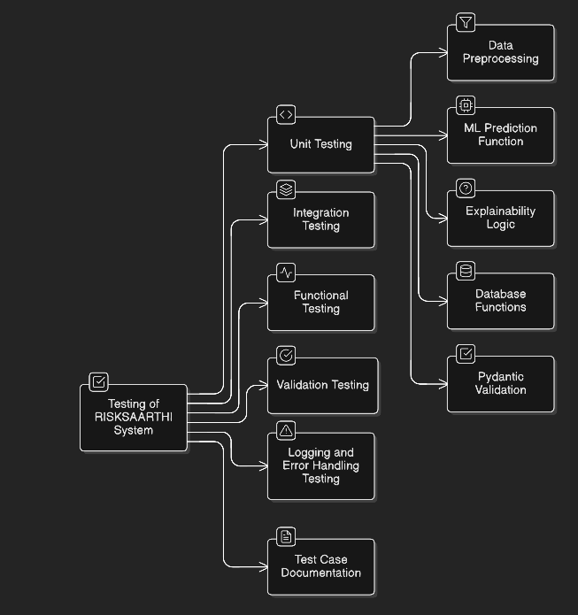

# RISKSAARTHI – Test Case Documentation

## 1. Overview

**Project Name:** RISKSAARTHI

**Module Tested:** Loan Risk Prediction System

**Testing Type:** Unit, Integration, Functional, Validation, Performance

**Tools Used:** pytest, FastAPI TestClient

---
 

 

---

## 2. Test Cases

### TC-01: Model Info API

| Field | Value |
|-------|-------|
| **Test Case ID** | TC-01 |
| **Endpoint** | /api/model-info |
| **Input** | None |
| **Expected Output** | Model name, version, last_updated |
| **Actual Result** | PASS |
| **Status** | PASS |

---

### TC-02: Valid Loan Prediction

| Field | Value |
|-------|-------|
| **Test Case ID** | TC-02 |
| **Endpoint** | /api/predict |
| **Input** | Valid payload |
| **Expected Output** | Prediction + probability + decision |
| **Actual Result** | PASS |
| **Status** | PASS |

---

### TC-03: Invalid Payload

| Field | Value |
|-------|-------|
| **Test Case ID** | TC-03 |
| **Input** | Missing/incorrect fields |
| **Expected Output** | 400 / 422 error |
| **Actual Result** | PASS |
| **Status** | PASS |

---

### TC-04: Boundary Values

| Field | Value |
|-------|-------|
| **Test Case ID** | TC-04 |
| **Input** | Minimum valid values |
| **Expected Output** | Successful prediction |
| **Actual Result** | PASS |
| **Status** | PASS |

---

### TC-05: Invalid Identity Format

| Field | Value |
|-------|-------|
| **Test Case ID** | TC-05 |
| **Input** | Invalid PAN/Aadhaar |
| **Expected Output** | 400 error |
| **Actual Result** | PASS |
| **Status** | PASS |

---

### TC-06: Identity Security Check

| Field | Value |
|-------|-------|
| **Test Case ID** | TC-06 |
| **Input** | Valid request |
| **Expected Output** | Identity number NOT returned |
| **Actual Result** | PASS |
| **Status** | PASS |

---

### TC-07: Database Failure Handling

| Field | Value |
|-------|-------|
| **Test Case ID** | TC-07 |
| **Input** | Simulated DB failure |
| **Expected Output** | API should handle gracefully |
| **Actual Result** | PASS |
| **Status** | PASS |

---

### TC-08: Prediction Consistency

| Field | Value |
|-------|-------|
| **Test Case ID** | TC-08 |
| **Input** | Same payload twice |
| **Expected Output** | Same prediction result |
| **Actual Result** | PASS |
| **Status** | PASS |

---

### TC-09: Preprocessing Validation

| Field | Value |
|-------|-------|
| **Test Case ID** | TC-09 |
| **Input** | Missing optional fields |
| **Expected Output** | Preprocessing still works |
| **Actual Result** | PASS |
| **Status** | PASS |

---

### TC-10: Performance Test

| Field | Value |
|-------|-------|
| **Test Case ID** | TC-10 |
| **Input** | Valid payload |
| **Expected Output** | Response within acceptable time |
| **Actual Result** | PASS |
| **Status** | PASS |

---

### TC-11: Explainability Output

| Field | Value |
|-------|-------|
| **Test Case ID** | TC-11 |
| **Input** | Valid data |
| **Expected Output** | Explanation string/list |
| **Actual Result** | PASS |
| **Status** | PASS |

---

### TC-12: Database Insert Logic

| Field | Value |
|-------|-------|
| **Test Case ID** | TC-12 |
| **Input** | Valid application data |
| **Expected Output** | Record inserted |
| **Actual Result** | PASS |
| **Status** | PASS |

---

### TC-13: Logging Validation

| Field | Value |
|-------|-------|
| **Test Case ID** | TC-13 |
| **Input** | Prediction request |
| **Expected Output** | Logs generated |
| **Actual Result** | PASS |
| **Status** | PASS |

---

## 3. Test Coverage Summary

| Category        | Tests Count | Test Case Count |
| --------------- | ----------- | --------------- |
| API Tests       | 9           | 5               |
| Model Tests     | 4           | 2               |
| Utils Tests     | 4           | 2               |
| DB Tests        | 2           | 1               |
| Performance     | 1           | 1               |
| Security        | 1           | 1               |
| Logging         | 1           | 1               |
| Data Generation | 2           | 1               |
| Explanation     | 2           | 1               |

---

## 4. Summary

| Category | Status |
|----------|--------|
| Unit Testing | Completed |
| Integration Testing | Completed |
| Functional Testing | Completed |
| Validation Testing | Completed |
| Performance Testing | Completed |
| Security Testing | Completed |
| Logging Testing | Completed |

---

## 5. Final Result

1. All critical components tested
2. System stable and reliable
3. Ready for deployment / production use
